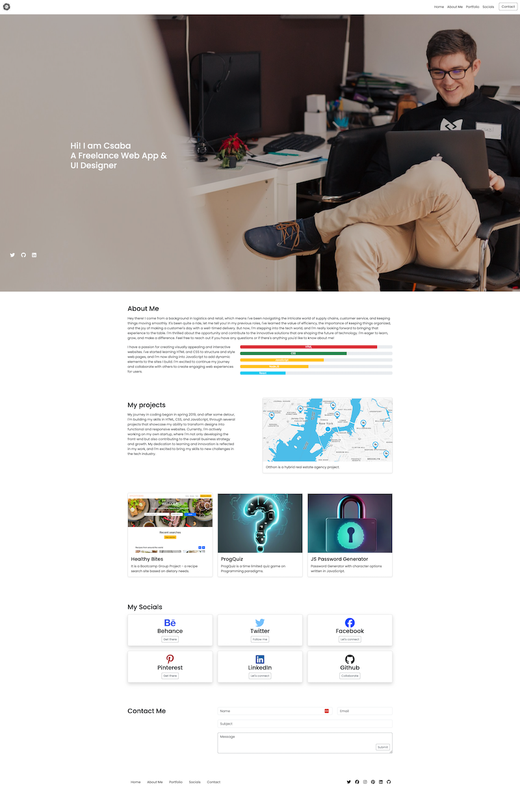

<!-- Improved compatibility of back to top link: See: https://github.com/othneildrew/Best-README-Template/pull/73 -->

[![Contributors][contributors-shield]][contributors-url]
[![Forks][forks-shield]][forks-url]
[![Stargazers][stars-shield]][stars-url]
[![Issues][issues-shield]][issues-url]
[![MIT License][license-shield]][license-url]

<!-- PROJECT LOGO -->
<br />
<div align="center">
  <a href="https://github.com/oIdioN/Bootstrap-Portfolio">
    
  </a>

<h3 align="center">Bootstrap Portfolio</h3>

  <p align="center">
   This challenge is about a Password Generator app features dynamically updated HTML and CSS, all powered by JavaScript. <br> App has to have a clean and polished user interface that is responsive, ensuring that it adapts to multiple screen sizes. <br> The password also includes special characters.
    <br />
    <br />
    <a href="https://github.com/oIdioN/Bootstrap-Portfolio">Repo page</a>
    ·
    <a href="https://oidion.github.io/Bootstrap-Portfolio">Deployed Application</a>
    ·
    <a href="https://github.com/oIdioN/Bootstrap-Portfolio/issues">Report Bug</a>
    ·
    <a href="https://github.com/oIdioN/Bootstrap-Portfolio/issues">Request Feature</a>
  </p>
</div>


<!-- TABLE OF CONTENTS -->
<details>
  <summary>Table of Contents</summary>
  <ol>
    <li>
      <a href="#about-the-project">About The Project</a>
      <ul>
        <li><a href="#built-with">Built With</a></li>
      </ul>
    </li>
    <li>
      <a href="#Description">Description</a>
      <ul>
        <li><a href="#prerequisites">Prerequisites</a></li>
        <li><a href="#installation">Installation</a></li>
      </ul>
    </li>
    <li><a href="#issues">Issues</a></li>
    <li><a href="#roadmap">Roadmap</a></li>
    <li><a href="#contributing">Contributing</a></li>
    <li><a href="#license">License</a></li>
    <li><a href="#contact">Contact</a></li>
  
  </ol>
</details>


<!-- ABOUT THE PROJECT -->
## About The Project


<br>
The cover ("above the fold") of the page.



<br>
The screenshot of the whole website.


<p align="right">(<a href="#readme-top">back to top</a>)</p>


### Built With

  


## Description 

This project is the third challenge of the 2023-24 edX Front-End Development Bootcamp.
This challenge is a Bootstrap-based version of a portfolio site showing to showcase skills and talents to employers looking to fill a part-time or full-time position. 

After learning about Grid, Flexbox, and Bootstrap, I decided that I would use Botstrap for future projects, for both harnessing the resources available and modifying code to reach the best possible outcome. Whilst the process of figuring out the way overriding the prebuilt classes and properties seems overwelhming, is exciting in the same time when the goal is to built something more visually appealing.

As I think about projects as in one hand a path to master how to work with Bootstrap and on the other hand a future professional portfolio site already, I started as like most will do: I looked for a starting point and found an example template on the official Bootstrap site. The final decission was to use a previous Portfolio challenge, and transform into a Bootstrap Portfolio.


### Prerequisites

* Using Bootstrap, recreate your portfolio site with the following items:
    * A navigation bar
    A navigation menu at the top. Feel free to use the navbar code provided in Bootstrap's documentation, or create your own navbar by applying the correct Bootstrap classes to your HTML.
      * Include links that are applicable to your portfolio.
      * Links should navigate to the appropriate sections

    * A hero section
      * A jumbotron featuring your picture, your name, and any other information you'd like to include.

    * A work section

      * A section displaying your work in grid.
      * If you need to use placeholder image use placehold.co 
      * Links to an external site.

      * Use Bootstrap cards for each project.
      * The description should give a brief overview of the work.

      * Each project will eventually link to your class project work!

    * A skills section
      * List out the skills you expect to learn from the bootcamp.

    * An about/contact section
      An About Me section in the same row.

    * A footer section
      * All hyperlinks should have a hover effect.
      * All buttons should display a box shadow upon hover.

* Your Bootstrap solution should minimize use of media queries.


### Features

The "submit" button at the contact area now lives inside the text area.


```
.textarea-container .submit-button {
    position: absolute;
    bottom: 15px; 
    right: 25px; 
  }
```


<p align="right">(<a href="#readme-top">back to top</a>)</p>


## Issues
At this point, a few issues are existing. All the issues had been left untreated, to serve as a training ground for working with git and version control.


<p align="right">(<a href="#readme-top">back to top</a>)</p>


<!-- ROADMAP -->
## Roadmap

- [ ] Layout considered
- [ ] Sections added
- [ ] Social links and images added

Future releases:
- [ ] Future challenges will be added\
- [ ] The code will go through extensive rework, such as updating with the missing sections.


See the [open issues](https://github.com/github_username/repo_name/issues) for a full list of proposed features (and known issues).

<p align="right">(<a href="#readme-top">back to top</a>)</p>


<!-- CONTRIBUTING -->
## Contributing

If you have a suggestion that would make this better, please fork the repo and create a pull request. You can also simply open an issue with the tag "enhancement".
Don't forget to give the project a star! Thanks again!


<p align="right">(<a href="#readme-top">back to top</a>)</p>


<!-- LICENSE -->
## License

Distributed under the MIT License.

<p align="right">(<a href="#readme-top">back to top</a>)</p>


<!-- CONTACT -->
## Contact


<p align="right">(<a href="#readme-top">back to top</a>)</p>


<!-- ACKNOWLEDGMENTS -->
## Acknowledgments


<p align="right">(<a href="#readme-top">back to top</a>)</p>

<!-- MARKDOWN LINKS & IMAGES -->
<!-- https://www.markdownguide.org/basic-syntax/#reference-style-links -->
[contributors-shield]: https://img.shields.io/github/contributors/oIdioN/JavaScript-Password-Generator-challenge.svg?style=for-the-badge
[contributors-url]: https://github.com/oIdioN/Bootstrap-Portfolio/graphs/contributors
[forks-shield]: https://img.shields.io/github/forks/oIdioN/JavaScript-Password-Generator-challenge.svg?style=for-the-badge
[forks-url]: https://github.com/oIdioN/Bootstrap-Portfolio/forks
[stars-shield]: https://img.shields.io/github/stars/oIdioN/JavaScript-Password-Generator-challenge.svg?style=for-the-badge
[stars-url]: https://github.com/oIdioN/Bootstrap-Portfolio/stargazers
[issues-shield]: https://img.shields.io/github/issues/ooIdioN/JavaScript-Password-Generator-challenge.svg?style=for-the-badge
[issues-url]: https://github.com/oIdioN/Bootstrap-Portfolio/issues 
[license-shield]: https://img.shields.io/github/license/oIdioN/JavaScript-Password-Generator-challenge.svg?style=for-the-badge
[license-url]: https://github.com/oIdioN/Bootstrap-Portfolio?tab=MIT-1-ov-file#readme
[product-screenshot]: src/images/screenshot/sitecover.png
[NodeJS]: https://img.shields.io/badge/node.js-6DA55F?style=for-the-badge&logo=node.js&logoColor=white
[Node-url]: https://nodejs.org/en
[JQuery.com]: https://img.shields.io/badge/jQuery-0769AD?style=for-the-badge&logo=jquery&logoColor=white
[JQuery-url]: https://jquery.com 
[Bulma]: https://img.shields.io/badge/bulma-00D0B1?style=for-the-badge&logo=bulma&logoColor=white


---
(c) 2024 oIdioN. All rights reserved.
</div>

